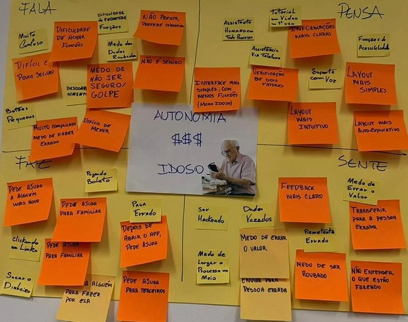

# PIX para todos — Portfólio de IHC

Portfólio acadêmico da disciplina de Introdução à Interação Humano-Computador (UFF · 2026.2).

**Tema:** a dificuldade de idosos não familiarizados com tecnologia em realizar
transferências bancárias via PIX.

## Como abrir

Basta abrir o arquivo `index.html` no navegador. Não há dependências, build ou banco de dados.

## Arquivos

```
index.html      → todo o conteúdo do site (seções comentadas)
css/styles.css  → estilos, organizado em blocos numerados
js/main.js      → tema claro/escuro, menu do celular e link ativo
img/            → imagens (fotos dos quadros, protótipos, telas)
docs/           → arquivos para download (planejamentos, roteiros, relatórios)
```

## Modo claro e escuro

O site tem os dois temas. O botão fica no canto superior direito e a escolha é
salva no navegador (`localStorage`). Na primeira visita, o site segue a preferência
do sistema operacional da pessoa.

As cores dos dois temas ficam no topo do `css/styles.css`:

- bloco `:root` → tema claro
- bloco `:root[data-tema="escuro"]` → tema escuro

Para mudar qualquer cor do site, basta editar essas variáveis — nenhum outro
trecho do CSS precisa ser alterado.

## Como preencher o conteúdo

Todo texto provisório está marcado com `[A PREENCHER]` e a classe `placeholder`
(aparece em cinza, com uma barra à esquerda). Para publicar um conteúdo real,
substitua o texto e remova a classe `placeholder`.

### Marcar uma etapa como concluída

No `index.html`, dentro da etapa, troque:

```html
<span class="etapa__status">Em breve</span>
```

por:

```html
<span class="etapa__status etapa__status--feito">Concluído</span>
```

Para uma etapa que já começou mas ainda não terminou:

```html
<span class="etapa__status etapa__status--andamento">Em andamento</span>
```

Etapas concluídas e em andamento já aparecem abertas; as "Em breve" começam
fechadas.

### Adicionar uma imagem a uma etapa

Coloque o arquivo em `img/` e use a classe `foto`:

```html
<figure class="foto">
  
  <figcaption>Legenda da imagem.</figcaption>
</figure>
```

### Adicionar um arquivo para download

Coloque o PDF em `docs/` e use a classe `arquivo`:

```html
<a class="arquivo" href="docs/nome-do-arquivo.pdf" download="Nome_Do_Arquivo.pdf">
  <svg class="arquivo__icone" viewBox="0 0 24 24" aria-hidden="true">…</svg>
  <span class="arquivo__texto">
    <strong>Título do arquivo</strong>
    <small>PDF &middot; 5 páginas &middot; 74 KB</small>
  </span>
</a>
```

### Ligar uma certeza da Matriz CSD a uma referência

Cada certeza tem uma etiqueta com o nome da fonte que aponta para a lista de
referências no fim da etapa:

```html
<a class="csd__fonte" href="#ref-csd-1" aria-label="Ver a referência 1: Portal Unit">…</a>
```

O número no `href` é o `id` do item da lista (`<li id="ref-csd-1">`). Para usar
uma nova fonte, basta acrescentar o item na lista com o próximo `id`.

### Adicionar uma nova seção

Copie o bloco de uma seção existente no `index.html`, troque o `id`, e adicione
o link correspondente no menu (`<nav class="nav">`). O destaque automático do
menu funciona sozinho a partir daí.

## Etapas do processo

| # | Etapa | Status |
|---|-------|--------|
| 01 | Definição do problema e How Might We | Concluído |
| 02 | Matriz CSD | Concluído |
| 03 | Mapa de Empatia | Concluído |
| 04 | Análise Competitiva | Concluído |
| 05 | Pesquisa com usuários | Em andamento |
| 06 | Análise dos resultados | Em andamento |
| 07 | Ideação | Em breve |
| 08 | Solução / Protótipo | Em breve |
| 09 | Avaliação | Em breve |
| 10 | Conclusões | Em breve |

## Publicação

O site é publicado pelo GitHub Pages a partir da branch `main` (pasta raiz):
https://uff-arthurmta.github.io/PortofolioIHC/

Todo push para `main` republica o site automaticamente em cerca de um minuto.

O CSS e o JS são chamados com `?v=N` no `index.html`. Sempre que mudar um desses
arquivos, aumente o número — assim o navegador não mostra a versão antiga guardada
em cache.
